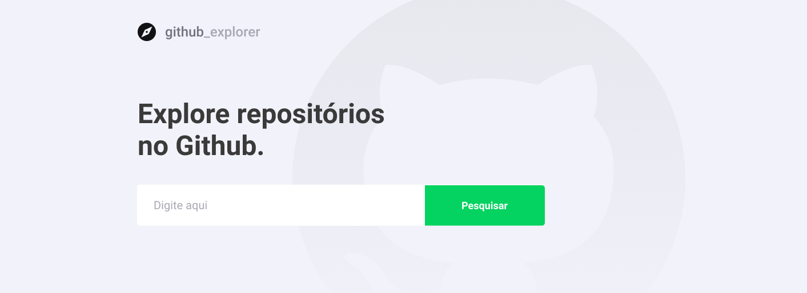

<p align="center">
    
   
   
</p>

<h1 align="center">
    
</h1>

<h4 align="center"> 
	🚧  Github Explorer 🚀 Finished 🚀 🚧
</h4>
<p align="center">Deployed <a href="https://primeiro-projeto-com-react.netlify.app/">here</a>.</p>

<p align="center">
 <a href="#about">About</a> •
 <a href="#layout">Layout</a> • 
 <a href="#how-it-works">How it works</a> • 
 <a href="#tech-stack">Tech Stack</a> • 
 <a href="#author">Author</a> • 
 <a href="#user-content-license">License</a>
</p>


## 💻 About

♻️ Github Explorer - é uma aplicação para explorar repositórios no Github. Com o repositorio escolhido você consegue ver as Stars, Forks e Issues abertas.

Nessa etapa daremos inicio ao aprendizado do ReactJS, criando o primeiro projeto já utilizando TypeScript.

Projeto desenvolvido durante o **Bootcamp GoStack** oferecida pela [Rocketseat](https://blog.rocketseat.com.br/).
O GoStack é um treinamento imersivo nas tecnologias mais modernas de desenvolvimento web e mobile.

---

## 🎨 Layout

The application layout is available on Figma:

<a href="https://www.figma.com/file/HOCmxfrElzLpI75LdzFLia/Github-Explorer?node-id=0%3A1">
  
</a>

### Web

<p align="center" style="display: flex; align-items: flex-start; justify-content: center;">
  

  
</p>

---

## 🚀 How it works

This project is done in one part:

1. Frontend (primeiro-projeto-com-react folder)

### Pré-requisites

Before you begin, you will need to have the following tools installed on your machine:
[Git] (https://git-scm.com), [Node.js] (https://nodejs.org/en/).
In addition, it is good to have an editor to work with the code like [VSCode] (https://code.visualstudio.com/)

#### 🧭 Running the web application

```bash

# Clone this repository
$ git clone https://github.com/marcelo-rafael/primeiro-projeto-com-react/

# Access the project folder in your terminal
$ cd primeiro-projeto-com-react

# Install the dependencies
$ yarn install or npm install

# Run the application in development mode
$ yarn start or npm run start

# The application will open on the port:3000 - acesse http://localhost:3000

```

---

## 🛠 Tech Stack

The following tools were used in the construction of the project:

#### **Website**  ([React](https://reactjs.org/)  +  [TypeScript](https://www.typescriptlang.org/))

-   **[React Router Dom](https://github.com/ReactTraining/react-router/tree/master/packages/react-router-dom)**
-   **[React Icons](https://react-icons.github.io/react-icons/)**
-   **[Axios](https://github.com/axios/axios)**
-   **[Polished](https://github.com/styled-components/polished)**
-   **[Styled Components](https://github.com/styled-components/styled-components)**

> See the file  [package.json](https://github.com/marcelo-rafael/primeiro-projeto-com-react/blob/master/package.json)

---

## Utilities

-   Prototype:  **[Figma](https://www.figma.com/)**  →  **[Protótipo (Github Explorer)](https://www.figma.com/file/HOCmxfrElzLpI75LdzFLia/Github-Explorer?node-id=0%3A1)**
-   API:  **[Github API](https://developer.github.com/v3/users/)**
-   Editor:  **[Visual Studio Code](https://code.visualstudio.com/)**
-   Markdown:  **[StackEdit](https://stackedit.io/)**,  **[Markdown Emoji](https://gist.github.com/rxaviers/7360908)**
-   Fonts: **[Roboto](https://fonts.google.com/specimen/Roboto)**

---

## 💪 How to contribute

1. Fork the project.
2. Create a new branch with your changes: `git checkout -b my-feature`
3. Save your changes and create a commit message telling you what you did: `git commit -m" feature: My new feature "`
4. Submit your changes: `git push origin my-feature`

---

## Author


[](https://www.linkedin.com/in/marcelo-rafael-gonçalves/) 
[](mailto:marcelo.rafael.goncalves@gmail.com)

---

## 📝 Licença

This project is under the license [MIT](./LICENSE).


Made with ❤️ by Marcelo Rafael Gonçalves 👋🏽 [Get in Touch!](https://www.linkedin.com/in/marcelo-rafael-gonçalves/)

---

##  Versions of README

[Português 🇧🇷](./README.md)  |  [Inglês 🇺🇸](./README-en.md)
