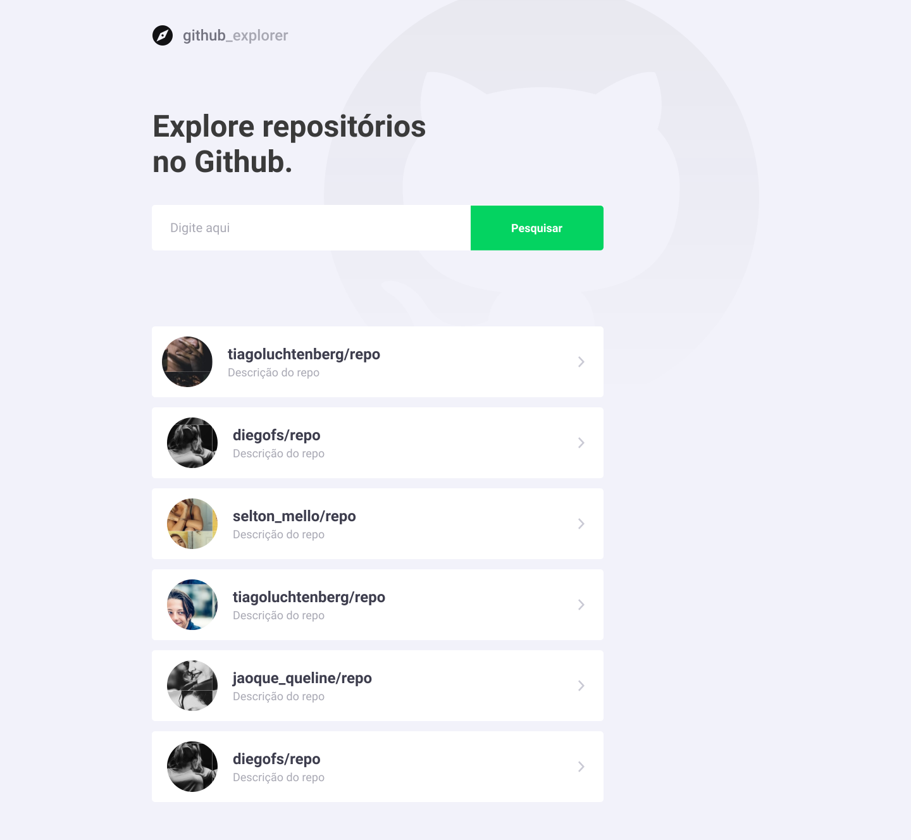

<h1 align="center">
Primeiro projeto com React
</h1>
<p align="center">Nessa etapa daremos inicio ao aprendizado do ReactJS, criando o primeiro projeto já utilizando TypeScript.</p>
<p align="center">Deployed <a href="https://primeiro-projeto-com-react.netlify.app/">here</a>.</p>

[](https://app.netlify.com/sites/primeiro-projeto-com-react/deploys)
<hr>

<p align="center">
  

  

  <a href="https://www.twitter.com/tgmarinho/">
    
  </a>
  
  <a href="https://github.com/tgmarinho/README-ecoleta/commits/master">
    
  </a>
    
   
   <a href="https://github.com/tgmarinho/README-ecoleta/stargazers">
    
  </a>

  <a href="https://rocketseat.com.br">
    
  </a>
  
  <a href="https://blog.rocketseat.com.br/">
    
    </a>
  
 
</p>
<h1 align="center">
    
</h1>

<h4 align="center"> 
	🚧  Github Explorer 🚀 Concluído 🚀 🚧
</h4>

<p align="center">
 <a href="#-sobre-o-projeto">Sobre</a> •
 <a href="#-layout">Layout</a> • 
 <a href="#-como-executar-o-projeto">Como executar</a> • 
 <a href="#-tecnologias">Tecnologias</a> • 
 <a href="#-autor">Autor</a> • 
 <a href="#user-content--licença">Licença</a>
</p>


## 💻 Sobre o projeto

♻️ Github Explorer - é uma aplicação para explorar repositórios no Github. Com o repositorio escolhido você consegue ver as Stars, Forks e Issues abertas.


Projeto desenvolvido durante o **Bootcamp GoStack** oferecida pela [Rocketseat](https://blog.rocketseat.com.br/).
O GoStack é um treinamento imersivo nas tecnologias mais modernas de desenvolvimento web e mobile.

---

## 🎨 Layout

O layout da aplicação está disponível no Figma:

<a href="https://www.figma.com/file/HOCmxfrElzLpI75LdzFLia/Github-Explorer?node-id=0%3A1">
  
</a>

### Web

<p align="center" style="display: flex; align-items: flex-start; justify-content: center;">
  

  
</p>

---

## 🚀 Como executar o projeto

Este projeto é feito em uma parte:

1. Frontend (pasta primeiro-projeto-com-react)

### Pré-requisitos

Antes de começar, você vai precisar ter instalado em sua máquina as seguintes ferramentas:
[Git](https://git-scm.com), [Node.js](https://nodejs.org/en/). 
Além disto é bom ter um editor para trabalhar com o código como [VSCode](https://code.visualstudio.com/)

#### 🧭 Rodando a aplicação web

```bash

# Clone este repositório
$ git clone https://github.com/marcelo-rafael/primeiro-projeto-com-react/

# Acesse a pasta do projeto no seu terminal/cmd
$ cd primeiro-projeto-com-react

# Instale as dependências
$ yarn install or npm install

# Execute a aplicação em modo de desenvolvimento
$ yarn start or npm run start

# A aplicação será aberta na porta:3000 - acesse http://localhost:3000

```

---

## 🛠 Tecnologias

As seguintes ferramentas foram usadas na construção do projeto:

#### **Website**  ([React](https://reactjs.org/)  +  [TypeScript](https://www.typescriptlang.org/))

-   **[React Router Dom](https://github.com/ReactTraining/react-router/tree/master/packages/react-router-dom)**
-   **[React Icons](https://react-icons.github.io/react-icons/)**
-   **[Axios](https://github.com/axios/axios)**
-   **[Polished](https://github.com/styled-components/polished)**
-   **[Styled Components](https://github.com/styled-components/styled-components)**

> Veja o arquivo  [package.json](https://github.com/marcelo-rafael/primeiro-projeto-com-react/blob/master/package.json)

---

## Utilitários

-   Protótipo:  **[Figma](https://www.figma.com/)**  →  **[Protótipo (Github Explorer)](https://www.figma.com/file/HOCmxfrElzLpI75LdzFLia/Github-Explorer?node-id=0%3A1)**
-   API:  **[Github API](https://developer.github.com/v3/users/)**
-   Editor:  **[Visual Studio Code](https://code.visualstudio.com/)**
-   Markdown:  **[StackEdit](https://stackedit.io/)**,  **[Markdown Emoji](https://gist.github.com/rxaviers/7360908)**
-   Fontes: **[Roboto](https://fonts.google.com/specimen/Roboto)**

---

## 💪 Como contribuir para o projeto

1. Faça um **fork** do projeto.
2. Crie uma nova branch com as suas alterações: `git checkout -b my-feature`
3. Salve as alterações e crie uma mensagem de commit contando o que você fez: `git commit -m "feature: My new feature"`
4. Envie as suas alterações: `git push origin my-feature`


---

## Autor


[](https://www.linkedin.com/in/marcelo-rafael-gonçalves/) 
[](mailto:marcelo.rafael.goncalves@gmail.com)

---

## 📝 Licença

Este projeto esta sobe a licença [MIT](./LICENSE).

Feito com ❤️ por Marcelo Rafael Gonçalves 👋🏽 [Entre em contato!](https://www.linkedin.com/in/marcelo-rafael-gonçalves/)

---

##  Versões do README

[Português 🇧🇷](./README.md)  |  [Inglês sem emojis 🇺🇸](./README-en.md)
